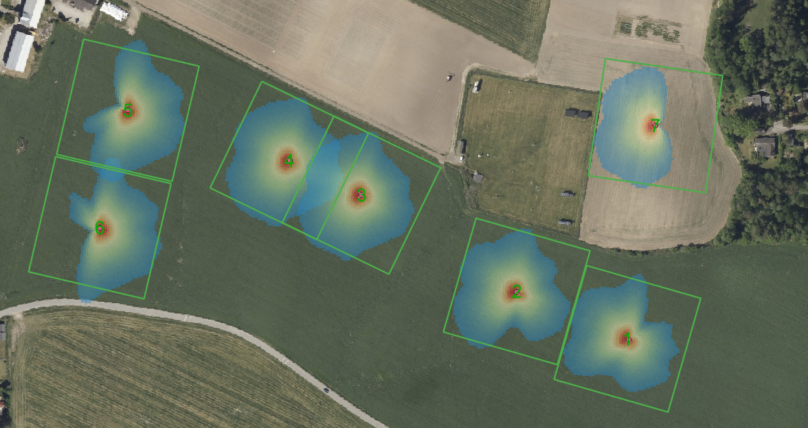

# DISCLAIMER

I AM NOT A METEOROLOGIST OR FLUID DYNAMICS EXPERT. i am just a generic engineer who wanted to run a lot of footprint calculations to visualize tower placements. I have no formal training in atmospheric science, and I cannot guarantee in any way that this workflow is scientifically valid. Use at your own risk. I am not responsible for any consequences of using this code.

# Standalone UMEP footprint workflow

This project runs the UMEP Source Area workflow. It can:

1. calculate directional morphometry around one or more candidate towers from
   matching DOM and DTM rasters;
2. Estimate meterological parameters from ERA5 and local weather data, such as friction velocity, Obukhov length, and boundary-layer height;
3. apply UMEP's Kanda et al. (2013) method to obtain directional roughness length (`z0`)
   and displacement height (`zd`);
4. combine those values with hourly meteorology and a dated crop-height
   schedule to add seasonal roughness to the UMEP input file;
5. run the Kljun et al. (2015) footprint parameterisation for large datasets with multiple workers in parallel. 
6. write GeoTIFFs, automatic QGIS styles, QC records, and tower-placement
   comparison tables.

The main command for normal use is `run_tower_batch.py`.

An example workflow is included for a small set of flux towers in southern Oslo, Norway. It uses 2 m derivatives of the original 0.5 m DOM and DTM rasters. The original rasters are not included in this repository because they are too large.

This is an example of the stable condition output from the included southern Oslo example:


## Installation

Python 3.11 is recommended. In Windows PowerShell:

```powershell
python -m venv .venv
.\.venv\Scripts\Activate.ps1
python -m pip install --upgrade pip
python -m pip install -r .\requirements.txt
```

If activation is blocked, call the environment directly:

```powershell
.\.venv\Scripts\python.exe .\run_tower_batch.py --help
```

Run the test suite with:

```powershell
.\.venv\Scripts\python.exe -m unittest discover -s tests -v
```

## Recommended full workflow

```powershell
python .\run_tower_batch.py `
  --dom .\maps\dom_soraas_extended_2m.tif `
  --dtm .\maps\dtm_soraas_extended_2m.tif `
  --towers .\maps\flux_towers.shp `
  --weather .\local_weatherdata\merged_footprint_weather_2025.csv `
  --measurement-height 2 `
  --sigma-v-ustar-ratio 2.0 `
  --crop-height-schedule .\crop_schedules\south_oslo_spring_cereal_example_2025.csv `
  --morphometry-radius 200 `
  --fetch 2000 `
  --resolution 5 `
  --interpolate-resolution 2.5 `
  --contours `
  --workers 10 `
  --display-percent 80 `
  --outputs footprint,season,stability `
  --raster-types density,percent `
  --start 2025-01-01 `
  --end 2026-01-01 `
  --output-dir .\output\placement_screening
```

For a quick screening run, use `--resolution 10`. This uses one quarter of the
grid cells of a 5 m run. Rerun shortlisted towers at 5 m.

`--workers 10` is a sensible starting point for the i9-10900X used for this
project. More workers increase memory use and may not improve throughput.

### Main spatial parameters

| Option | Meaning |
|---|---|
| `--morphometry-radius 200` | Half-width of the DOM/DTM subset around each tower. A value of 200 produces an approximately 400 x 400 m analysis window. `--morphometry-distance` is an alias. |
| `--fetch 2000` | Requested half-width of the footprint output domain. |
| `--resolution 5` | Footprint raster cell size in metres. |
| `--interpolate-resolution 2.5` | Replaces every requested coarse raster with a smoothed raster at this finer cell size. |
| `--contours` | Writes labelled cumulative-percentage contour lines with a QGIS style for every requested output. |
| `--outputs footprint,season,stability` | Selects annual, seasonal, stability, and/or wind-sector output groups. |
| `--raster-types density,percent` | Selects density rasters, cumulative-percent rasters, or both. |
| `--display-percent 80` | Cumulative percentage shown by the generated QGIS style. It does not discard values from the raster. |
| `--angle-step 5` | Direction interval used for morphometry; it must divide 360. |

The output grid is always centred on the tower. If `2 * fetch` is not exactly
divisible by the resolution, the actual symmetric extent is rounded up to the
next complete cell.

### Tower input

A point shapefile or CSV can be used.

CSV columns:

```csv
id,x,y,measurement_height_m
1,599753,6615344,2.0
2,599600,6615400,2.0
```

- `id` is optional but strongly recommended and must be unique.
- `measurement_height_m` is optional when `--measurement-height` is supplied.
- Shapefiles are transformed to the raster CRS using their `.prj` file.
- CSV coordinates are assumed to already use the DOM/DTM CRS.
- DOM and DTM must have identical CRS, transform, dimensions, square pixels,
  and complete data inside every requested analysis window.

### Batch outputs

Each tower receives its own directory containing:

- `morphology.txt` - directional `pai`, `fai`, height statistics, `zd`, and
  `z0`;
- `umep_input.txt` - hourly 13-column UMEP input;
- `footprint_density.tif` - mean footprint density in m-2, when requested;
- `footprint_percent.tif` - cumulative contribution rank from 1 to 100, when requested;
- matching `.qml` files for automatic QGIS rendering;
- optional interpolated rasters and styled contour layers for every requested
  output;
- `footprint_qc.csv` - skipped timestamps and rejection reasons;
- selected category rasters and `footprint_placement_summary.csv`.

The batch directory also receives `placement_comparison.csv`, combining all
tower summaries. The terminal reports elapsed time per tower and for the full
batch.

QGIS often locks loaded GeoTIFFs on Windows. If an existing raster cannot be
replaced, the runner writes a matched pair such as
`footprint_run2_density.tif` and `footprint_run2_percent.tif`.

### Interpolated rasters and contours

Add the following to the batch or standalone command:

```powershell
--interpolate-resolution 2.5 `
--contours `
--contour-levels 10,20,30,40,50,60,70,80 `
--contour-smoothing 1.0
```

This writes the selected finer raster type(s) instead of each corresponding
coarse raster and writes cumulative-footprint contours as shapefiles. The
matching QML renders thin dark lines with one buffered percentage label placed
directly on each contour, so QGIS can load the layer without manual style
copying.
Smoothing is expressed in original raster cells. If `--contours` is supplied
without `--interpolate-resolution`, half the original cell size is used.

Interpolation improves presentation and contour geometry; it does not add
meteorological or spatial information. Interpolation and contours are applied
to every requested output group and category. For example, requesting
`footprint,season,stability` creates interpolated annual, growing/dormant, and
unstable/neutral/stable products and contours.

## What the 13 UMEP columns contain

```text
iy id it imin z_0_input z_d_input z_m_input sigv Obukhov ustar dir h por
```

| Column | Source |
|---|---|
| `iy id it imin` | Calculated from the hourly timestamp; `id` is day of year here, not tower ID. |
| `z_0_input`, `z_d_input` | Directional DOM-DTM morphometry and Kanda method, with crop roughness in zero-object sectors. |
| `z_m_input` | Measurement height above local ground. |
| `sigv` | Direct weather value when available; otherwise an explicit fallback such as `--sigma-v-ustar-ratio 2.0`. |
| `Obukhov`, `ustar` | Weather input, normally derived from ERA5 turbulent fluxes and stresses. |
| `dir` | Meteorological direction from which the wind comes. |
| `h` | Boundary-layer height, normally ERA5 `blh`. |
| `por` | User setting, default 60 percent. It is retained for UMEP compatibility but is not used by the Kljun footprint equation. |

Weather-file values take precedence over command-line fallbacks.

## Crop roughness

The morphometric calculator returns `z0=0` and `zd=0` in directions without
resolved objects above 2 m. These zeros are not realistic for soil or crops.
Supply a dated schedule:

```csv
date,height_m
2025-05-01,0.05
2025-06-01,0.30
2025-07-01,0.75
2025-09-01,0.05
```

Crop height is linearly interpolated by date and held at the first or last
value outside the schedule. In zero-object sectors:

```text
zd = (2/3) * crop height
z0 = max(0.01 m, 0.123 * crop height)
```

For a schedule that repeats every year, omit the year and use:

```csv
month,day,height_m
1,1,0.00
4,20,0.00
5,20,0.15
6,20,0.60
7,5,0.80
9,5,0.05
12,31,0.00
```

The recurring schedule is mapped onto each weather year independently. It
uses the same linear interpolation and endpoint-holding behaviour as the
dated format. A recurring 29 February point maps to 28 February in non-leap
years.

Change these assumptions with `--crop-zd-factor`, `--crop-z0-factor`, and
`--minimum-z0` when running the lower-level generator. The included spring
cereal schedule is illustrative and should be replaced with observations for
the actual crop and year.

## Physical validation and skipped records

For every Kljun record, the workflow checks:

```text
effective height = measurement height - zd
measurement height > zd + 12.5*z0
ustar > 0.1 m/s
boundary-layer height > 10 m
effective height < boundary-layer height
effective height / Obukhov >= -15.5
Obukhov != 0
```

The batch command defaults to `--invalid-row-policy skip`. Invalid hours are
listed in the QC CSV. Use `--invalid-row-policy error` to stop immediately.

Many invalid records near forest or buildings do not mean that the footprint
model simulated wakes. They usually mean that directional Kanda roughness
made the nominal sensor height fall below the displacement height or
roughness-sublayer requirement. Low `ustar` is another common cause.

Reducing the morphometry radius can reduce this rejection count, but it also
removes nearby roughness elements from the calculation. Treat radius changes
as a sensitivity test, not as a way to force records to pass.

## Placement analysis

Use `--outputs` to select one or more groups:

- `footprint`: annual;
- `season`: growing and dormant seasons;
- `stability`: unstable, neutral, and stable conditions;
- `wind`: eight meteorological wind sectors.

For example:

```powershell
--outputs footprint,season,stability `
--raster-types percent
```

`--placement-analysis` remains as a shortcut for all four output groups.

The growing season defaults to April-October. Change it with, for example:

```powershell
--growing-months 5-9
```

`captured_mass` is the integral of the mean footprint within the output
domain. Values near 1 indicate that the selected fetch is large enough.
`area80_m2` is the area containing 80 percent of the mass captured by that
domain. Compare valid-hour counts alongside footprint size: a compact annual
footprint can be misleading when many obstructed wind sectors were rejected.

For tower placement, the most useful next metric is usually the fraction of
footprint contribution falling inside the intended plot polygon. That metric
is not currently calculated by this repository.

## Morphometry only

The repository uses compressed 2 m derivatives of the full-resolution source
rasters. Recreate them with:

```powershell
python .\resample_maps.py `
  --dom .\maps\dom_soraas_extended.tif `
  --dtm .\maps\dtm_soraas_extended.tif `
  --output-dom .\maps\dom_soraas_extended_2m.tif `
  --output-dtm .\maps\dtm_soraas_extended_2m.tif `
  --resolution 2 `
  --method bilinear
```

The original rasters are ignored by Git. Bilinear resampling is appropriate
for continuous elevation surfaces; the resulting loss of narrow object detail
should be considered when interpreting directional morphometry.

```powershell
python .\calculate_morphometry.py `
  --dom .\maps\dom_soraas_extended_2m.tif `
  --dtm .\maps\dtm_soraas_extended_2m.tif `
  --towers .\maps\flux_towers.shp `
  --radius 200 `
  --angle-step 5 `
  --output-dir .\output\morphometry
```

The calculation subtracts DTM from DOM, sets objects below 2 m to zero,
rotates the object-height raster for each direction, samples UMEP's upwind
centre ray, and applies Kanda method 1.

## Generate UMEP input only

```powershell
python .\generate_umep_footprint_input.py `
  --morphology .\output\morphometry\1\morphology.txt `
  --weather .\local_weatherdata\merged_footprint_weather_2025.csv `
  --crop-height-schedule .\crop_schedules\south_oslo_spring_cereal_example_2025.csv `
  --measurement-height 2 `
  --sigma-v-ustar-ratio 2.0 `
  --invalid-row-policy skip `
  --start 2025-01-01 `
  --end 2026-01-01 `
  --output .\output\umep_input.txt
```

The generator also supports fixed sensitivity fallbacks for `ustar`, `sigv`,
Obukhov length, and boundary-layer height. Run `--help` for all options.

## Run an existing UMEP input file

```powershell
python .\run_footprint_standalone.py `
  --input .\output\umep_input.txt `
  --tower-x 599753 `
  --tower-y 6615344 `
  --crs EPSG:25832 `
  --fetch 2000 `
  --resolution 5 `
  --workers 10 `
  --display-percent 80 `
  --interpolate-resolution 2.5 `
  --contours `
  --output-prefix .\output\standalone\footprint
```

Append `--limit 10` for a short smoke test.

## ERA5 download and weather merge

`download_era5_footprint_data.py` downloads monthly ERA5 files containing the
fields needed for friction velocity, Obukhov length, and boundary-layer
height. It uses the standard CDS credentials file:

```text
C:\Users\<user>\.cdsapirc
```

Inspect requests without downloading:

```powershell
python .\download_era5_footprint_data.py --year 2025 --dry-run
```

Download or resume all twelve months:

```powershell
python .\download_era5_footprint_data.py --year 2025
```

Existing files are skipped unless `--overwrite` is used. A single month can
be requested with `--month 1`; its default filename includes the month, for
example `era5_footprint_parameters_2024_01.nc`. When `--output` is supplied
for a single month, that exact path is used.

Merge ERA5 with the configured local Frost.met.no observations:

```powershell
python .\merge_footprint_weather.py `
  --frost .\local_weatherdata\frost_part1.csv .\local_weatherdata\frost_part2.csv
```

`--frost` accepts any number of files and may also be repeated. Overlapping
observations are resolved together using the same quality-first and
station-priority rules as a single input file. Without `--year`, all monthly
ERA5 files in `--era5-directory` are merged and the default output is named
for the discovered range, for example
`merged_footprint_weather_2024-2025.csv`. Add `--year 2025` to restrict the
merge to one calendar year.

Incomplete calendar years are warned about and excluded by default. Pass
`--allow-partial` to retain them, for example when inspecting data before all
monthly files exist. If no complete year remains, the merge stops rather than
writing an empty result.
The merge:

- prefers configured local Frost wind, temperature, dew point, and pressure;
- uses ERA5 surface wind as the missing/calm-wind fallback;
- retains ERA5 boundary-layer height;
- derives `ustar` and Obukhov length from ERA5 stress and turbulent fluxes;
- records provenance fields and flags `sdfor >= 50 m`.

Current ERA5 downloads include `u10/v10` as a fallback for missing or calm
local wind. Hours lacking both Frost and ERA5 wind are skipped with a warning;
use `--missing-wind-policy error` to abort instead. The default output filename
uses the selected or discovered year range, while `--output` is used exactly
as supplied.

ERA5 and hourly Frost data do not provide high-frequency lateral wind
variance. A sonic anemometer is preferred for `sigv`; otherwise the chosen
`sigv/ustar` ratio remains a sensitivity assumption.

## Model limitations

This is an analytical footprint model over horizontally homogeneous flow.
DOM and DTM data are reduced to directional scalar `z0` and `zd`. Therefore:

- buildings and forest influence roughness and record validity;
- individual building wakes, recirculation, forest-edge turbulence, terrain
  flow deflection, and porous-canopy flow are not explicitly simulated;
- trees above the 2 m threshold are effectively treated as roughness objects,
  not as a resolved porous canopy;
- generated annual maps include only valid hours;
- footprint-weighted Kanda values in the UMEP plugin are diagnostic and are
  not fed back iteratively into the same hourly footprint.

Two sites with identical hourly `z0`, `zd`, and meteorology produce the same
Kljun footprint even if their detailed building layouts differ. Explicit wake
analysis requires a flow model such as URock, CFD, or LES plus an appropriate
dispersion/back-trajectory treatment.
